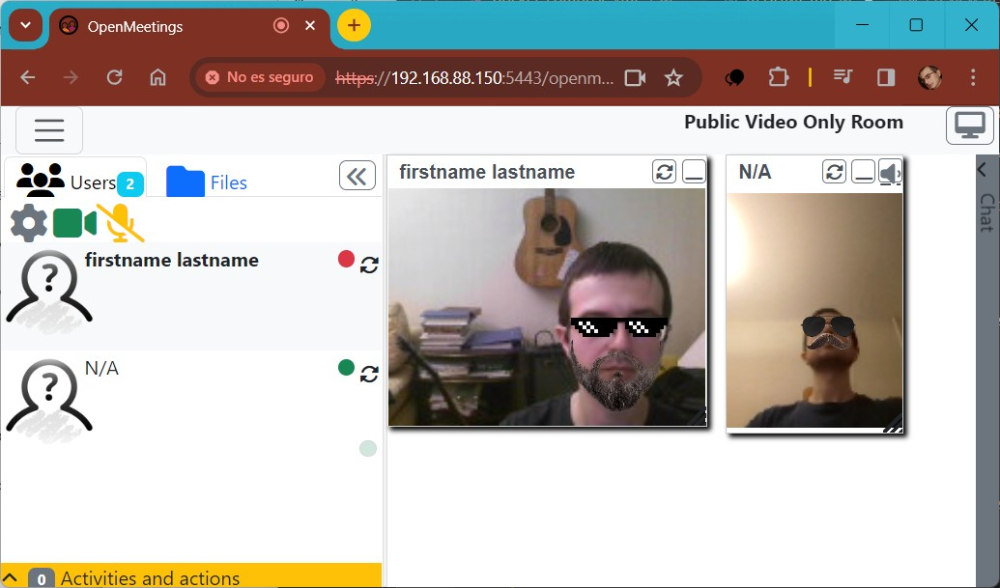

# Контейнер OpenMeetings
## Установка Alma Linux в Hyper-V
[Образ AlmaLinux OS 9.3 Boot ISO](https://almalinux.org/ru/get-almalinux).
Пользователь `amakarov` (администратор).

[Ошибка "The signed image’s hash is not allowed"](https://ekiwi-blog.de/en/23430/hyper-v-uefi-error-message-the-signed-images-hash-is-not-allowed),
[[2]](https://ao-system.net/en/note/187). Отключить Безопасную загрузку в настройках ВМ.

Произвести настройку ВМ для работы в дальнейшем с сетью типа *macvlan*:
- Создать "внешний" коммутатор в Диспетчере виртуальных коммутаторов Hyper-V и
подключить его в параметрах ВМ. Виртуальная машина будет получать IP по DHCP.
- В параметрах ВМ [включить](https://serverfault.com/questions/812528/docker-container-connection-in-macvlan-network)
*Сетевой адаптер / Дополнительные параметры / [v] Включить спуфинг MAC-адресов*


## Расширенная сессия Hyper-V
- [Guide and scripts for RedHat Enterprise Linux 8 VM on Hyper-V with Enhanced Session Mode](https://github.com/EtienneBarbier/Hyper-V-RHEL-8-VM)
- [modules-load.d](https://www.freedesktop.org/software/systemd/man/latest/modules-load.d.html)
```bash
sudo yum install hyperv-tools
echo "hv_sock" | sudo tee -a /etc/modules-load.d/hv_sock.conf
```
После перезагрузки проверяем, что модуль загружен `lsmod | grep hv_sock`

Устанавливаем и настраиваем xrdp и xrdp session manager:
```bash
sudo yum install epel-release
sudo yum install xrdp xrdp-selinux
sudo systemctl enable xrdp xrdp-sesman

# Настройка xrdp
sudo sed -i -e 's/port=3389/port=vsock:\/\/-1:3389/g' /etc/xrdp/xrdp.ini
sudo sed -i -e 's/security_layer=negotiate/security_layer=rdp/g' /etc/xrdp/xrdp.ini
sudo sed -i -e 's/crypt_level=high/crypt_level=none/g' /etc/xrdp/xrdp.ini
sudo sed -i -e 's/bitmap_compression=true/bitmap_compression=false/g' /etc/xrdp/xrdp.ini

# Настройка xrdp session manager
sudo sed -i -e 's/FuseMountName=thinclient_drives/FuseMountName=shared-drives/g' /etc/xrdp/sesman.ini

echo "allowed_users=anybody" | sudo tee -a /etc/X11/Xwrapper.config

# Разрешить порт
sudo firewall-cmd --add-port=3389/tcp --permanent
sudo firewall-cmd --reload
```

В параметрах ВМ включить *Службы интеграции / [v] Гостевые службы*.

Изменить тип расширенной сессии для ВМ:
```powershell
Set-VM "Alma Linux 9" -EnhancedSessionTransportType HVSocket
Get-VM "Alma Linux 9" | Select-Object EnhancedSessionTransportType  # проверка
```


## Установка Docker
- [How To Setup Joomla, MySQL, and phpMyAdmin on a Docker Container](https://blog.racknerd.com/how-to-setup-joomla-mysql-and-phpmyadmin-on-a-docker-container)

```bash
sudo yum install yum-utils
sudo yum-config-manager --add-repo https://download.docker.com/linux/centos/docker-ce.repo
sudo yum install docker-ce
sudo systemctl enable docker
sudo systemctl start docker
```

Выполнение команд Docker без `sudo` [[1]](https://www.digitalocean.com/community/tutorials/how-to-install-and-use-docker-on-rocky-linux-9#step-2-executing-docker-command-without-sudo-optional):
```bash
sudo usermod -aG docker $(whoami)
```
Перезагрузить ВМ.


## Запуск Apache OpenMeetings
Установить *git*: `sudo yum install git`

Сгенерировать ключ: `ssh-keygen -t ed25519 -b 2048`

Добавить ключ `~/.ssh/id_ed25519.pub` на GitHub: *Settings / SSH and GPG keys / New SSH key*

Клонировать данный репозиторий: `git clone git@github.com:Winand/sirius-openmeetings.git`

В файле *docker-compose.yml* изменить параметры в соответствии с конфигурацией сети:
- `subnet:` - локальная сеть с маской
- `gateway:` - адрес шлюза (роутера)
- `ipv4_addr:` - адрес контейнера в сети (не должен быть занят!)

Запустить OpenMeetings:
```bash
cd sirius-openmeetings
docker compose up -d
```

Перейти по адресу `https://<ipv4_addr>:5443/openmeetings` с любого компьютера
в локальной сети (из самой ВМ зайти не удаётся!).
Указать логин *om_admin* и пароль *1Q2w3e4r5t^y*.

Перейти в Administration / Users и создать нового пользователя:
- Login: *test*
- Password: *Password1!*
- Email address: *test@example.com*
- Usergroup: *group*

На главной странице нажать *Start Conference* и зайти в одну комнату с двух
устройств для проверки функциональности. 

## База данных
В задании требуется перенести БД на том *VOLUME* и подключить его как локальную папку.

Если подключить директорию с данными встроенной СУБД MySQL */var/lib/mysql* к хосту,
то БД не работает, в логе */var/log/mysql/error.log* возникает ошибка
"Failed to find valid data directory", т. к. папка пустая и БД не инициализируется.
См. также [docker-compose doesn't start mysql:8 correctly](https://stackoverflow.com/questions/58021378/docker-compose-doesnt-start-mysql8-correctly).

Для решения этой проблемы поднят отдельный контейнер MariaDB.

## Дополнительные ссылки
- [Networking using a macvlan network](https://docs.docker.com/network/network-tutorial-macvlan)
- [Пример docker-compose.yml для сети macvlan](https://github.com/sarunas-zilinskas/docker-compose-macvlan/blob/master/docker-compose.yml)
- [Docker Macvlan Demystify](https://msazure.club/docker-macvlan-demystify)
- [MACVLAN network for Plex (Reddit)](https://www.reddit.com/r/docker/comments/8xn3yx/macvlan_network_for_plex)
